<p align="center">
  
</p>

<p align="center">
  
  
  
  
  
  
</p>

<p align="center">
  <b>A production-grade, safe, cross-platform CLI tool to organize, clean, deduplicate, and analyze disk storage.</b><br/>
  Zero overwrites. Dry-run by default. Moves files to native OS Trash instead of permanent destruction.
</p>

---

## 🖥️ Live Terminal Preview

<p align="center">
  
</p>

---

## ⚡ Highlights

| Feature | Description |
|:---|:---|
| 🛡️ **Safety Guardrails** | Hardware refusal for system roots (`/`, `C:\`, `/etc`) and bare home directories (`~`). |
| 🗑️ **Native OS Trash** | Uses `send2trash` (Windows Recycle Bin / FreeDesktop Trash / macOS Trash). Nothing is permanently lost unless `--permanent` is explicitly requested. |
| ↩️ **Full Operation Undo** | Every action logs an atomic manifest. Run `sfc undo` to restore files back to their exact original paths. |
| 🔍 **3-Tier Deduplication** | Size filtering &rarr; 4KB partial hash &rarr; full SHA-256. Lightning fast duplicate detection. |
| 📊 **Disk Analysis Dashboard** | Rich category breakdown, top-N space hogs, and stale file detection. |
| ⚙️ **XDG-Compliant Config** | TOML configuration layered across CLI flags &gt; environment variables &gt; user config &gt; defaults. |
| 🤖 **Pipeline Ready** | Pass `--output json` to pipe structured output directly into `jq` or CI scripts. |

---

## 🚀 Quick Install

### Using `pipx` (Recommended)
```bash
pipx install git+https://github.com/vallkyrionfr/smart-file-cleaner.git
```

### Using `pip`
```bash
git clone https://github.com/vallkyrionfr/smart-file-cleaner.git
cd smart-file-cleaner
python3 -m venv .venv
source .venv/bin/activate  # On Windows: .\.venv\Scripts\Activate.ps1
pip install -e ".[dev]"
```

Both `smart-file-cleaner` and the short alias `sfc` are registered upon installation:
```bash
sfc --version
sfc --help
```

---

## 💻 Command Reference

### 1. File Categorization (`organize`)

Sorts loose files into intuitive category folders (`Images`, `Documents`, `Code`, `Videos`, `Installers`, `Archives`, `Spreadsheets`, `Presentations`, `Audio`).

- **Auto-rename collision avoidance**: Identical filenames are renamed with `_1`, `_2` suffixes so existing files are never overwritten.
- **Symlink & hidden file immunity**: Symlinks and dotfiles are strictly preserved.

```bash
# Preview what would be organized (dry-run by default)
sfc organize ~/Downloads

# Apply changes
sfc organize ~/Downloads --execute
```

---

### 2. Junk & Cruft Cleanup (`clean`)

Scans for temporary files (`*.tmp`, `*.bak`, `*.~*`, `~$*`), OS artifacts (`.DS_Store`, `Thumbs.db`, `desktop.ini`), build caches (`__pycache__`, `.pytest_cache`, `.mypy_cache`), and empty directory trees.

```bash
# Preview junk files and empty directories
sfc clean ~/Downloads

# Recurse into subdirectories
sfc clean ~/Downloads --recursive

# Delete junk to OS Trash
sfc clean ~/Downloads --execute

# Hard-delete permanently (prompts for confirmation)
sfc clean ~/Downloads --execute --permanent

# Machine-readable JSON output
sfc clean ~/Downloads --output json
```

---

### 3. Duplicate Detection & Removal (`dedupe`)

Uses a high-performance **3-tier hashing pipeline**:
1. **Tier 1 (Size bucketing)**: `os.stat` instant filter. Unique byte sizes are immediately skipped.
2. **Tier 2 (4KB Partial Hash)**: Cheap header hash for files with identical byte sizes.
3. **Tier 3 (Full SHA-256)**: Comprehensive streaming hash for true duplicate confirmation.

```bash
# Preview duplicate groups and wasted disk space
sfc dedupe ~/Downloads

# Keep newest file and send duplicates to Trash
sfc dedupe ~/Downloads --execute --keep newest

# Keep oldest file
sfc dedupe ~/Downloads --execute --keep oldest

# Filter minimum file size (e.g. ignore files smaller than 100KB)
sfc dedupe ~/Downloads --min-size 102400
```

---

### 4. Storage Analysis Dashboard (`analyze`)

Terminal visualizer providing an executive summary of folder space distribution.

```bash
# Analyze directory
sfc analyze ~/Downloads

# Show top 20 largest files with stale threshold of 60 days
sfc analyze ~/Downloads --top 20 --stale-days 60 --recursive

# Output JSON for reporting
sfc analyze ~/Downloads --output json
```

---

### 5. Instant Undo & Rollback (`undo`)

Reverses the effects of any previous `organize`, `clean`, or `dedupe` command.

```bash
# View recent operation history
sfc undo --list

# Preview rollback of the most recent operation
sfc undo

# Execute rollback
sfc undo --execute

# Rollback a specific historical operation by ID
sfc undo --id 20260920T001523 --execute
```

---

### 6. Interactive Download Triage (`review`)

Step-by-step interactive triage for unruly directories:

```bash
sfc review ~/Downloads
```

Categorizes items into:
- 📦 **Unused Installers** (`.exe`, `.msi`, `.dmg`, `.deb`, `.iso`)
- 🐘 **Large Files** (&ge; 100MB)
- ⏳ **Stale Files** (untouched &ge; 30 days)
- 🗂️ **Uncategorized Clutter**

Interactive actions available per file:
- `[1]` Move to `SortLater/` subfolder
- `[2]` Auto-Sort into extension folder
- `[3]` Keep in place (Skip)
- `[A]` Auto-Sort all remaining
- `[L]` Move all remaining to `SortLater/`
- `[Q]` Quit

---

### 7. Configuration Engine (`config`)

`smart-file-cleaner` respects the XDG Base Directory specification:
- **Linux**: `~/.config/smart-file-cleaner/config.toml`
- **Windows**: `%APPDATA%\smart-file-cleaner\config.toml`
- **macOS**: `~/Library/Application Support/smart-file-cleaner/config.toml`

```bash
# Show active effective configuration
sfc config show

# Print configuration file path
sfc config path

# Initialize default configuration file
sfc config init
```

Example `config.toml`:
```toml
[defaults]
dry_run = true
recursive = false
output = "text"

[clean]
junk_patterns = ["*.tmp", "*.temp", "~$*", "*.bak", "*.swp"]
os_cruft = [".DS_Store", "Thumbs.db", "desktop.ini"]
dev_caches = ["__pycache__", ".pytest_cache", ".mypy_cache", "node_modules/.cache"]
protected = [".git", ".svn", ".hg", ".venv", "node_modules"]

[dedupe]
min_size_bytes = 1
keep_strategy = "newest"

[review]
stale_days = 30
large_mb = 100.0
```

---

## 🧪 Testing & Quality Gates

Run the test suite with coverage, formatters, and type checkers:

```bash
# Run pytest with coverage gate (80% minimum)
pytest --cov=smart_file_cleaner --cov-report=term-missing

# Lint and format check (Ruff)
ruff check src/ tests/
ruff format --check src/ tests/

# Static type checking (Mypy)
mypy src/
```

---

## 📄 License

Distributed under the [MIT License](LICENSE).
